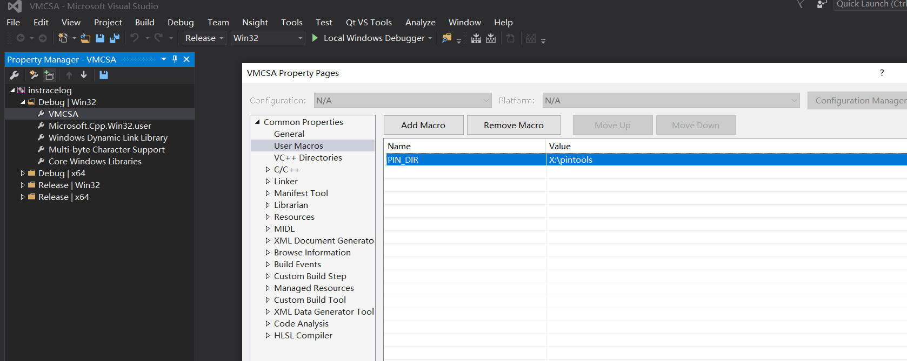

## 工程配置

该项目需要引用 [pintools库](#https://www.intel.com/content/www/us/en/developer/articles/tool/pin-a-dynamic-binary-instrumentation-tool.html) ，测试版本为 3.11。

库的路径直接由一个环境变量指定，可以直接在 [VMCSA.props](VMCSA.props) 文件中的修改 `<PIN_DIR>X:\pintools</PIN_DIR>` 为自己的pintools文件夹目录

或者在VS中选择 View - Other Windows - Property Manager下的instracelog，展开自己需要的配置的选项卡（如 Release | Win32），双击VMCSA，选择 User Macros，在其中更改为自己的目录



## Trace记录

这里记录的trace除了instracelog_full.cpp外都是锚点间的trace

### instracelog.cpp

32位的trace记录，程序从一个文件读入当前被测试的混淆程序使用的锚点，并记录锚点指令之间的trace

#### 命令行参数

* -i  一个用于存放当前C源文件生成时使用的锚点的文件
* -o  输出的trace文件名

#### 输出格式

内容格式为

```
地址; 指令长度; EAX; EBX; ECX; EDX; ESI; EDI; ESP; EBP; EFLAGS; 指令读取的地址; 指令写入的地址; 指令的hex串;
```

### instracelog_detail.cpp

与上面的程序类似，但附带了更多的信息

#### 命令行参数

* -i  一个用于存放当前C源文件生成时使用的锚点的文件
* -o  输出的trace文件名

#### 输出格式

```
地址; 指令长度; EAX; EBX; ECX; EDX; ESI; EDI; ESP; EBP; EFLAGS; 指令读取的地址; 指令写入的地址; 指令的hex串; 指令汇编
```

### instracelog_64.cpp

64位的trace记录，将原来的寄存器改为64位形式，并且多记录了 R8~R15 这几个寄存器的值

#### 命令行参数

* -i  一个用于存放当前C源文件生成时使用的锚点的文件
* -o  输出的trace文件名

### instracelog_full.cpp

用于记录除库函数外的所有指令trace。因为不是记录锚点间的指令，所以该程序没有-i选项

#### 命令行参数

* -o  输出的trace文件名

### instracelog_insdel.cpp

这里使用了pin中的INS_Delete函数来删除被测试的指令。

这是因为一些指令可能对运行时的上下文有一定要求，比如一些Ring0指令。通常情况下，因为vmp的保护对象一般是用户态程序，所以对于Ring0指令一般是不处理的，且大多数Ring0指令都不能被vmp提供的虚拟机所模拟，因此大多数Ring0指令都应是可用的anchor。

众所周知，Ring0指令不可能在用户态下被运行，但由于pintools本身的运行原理类似一个JIT，在指令运行前我们都可以对要运行的指令进行hook，因此可以在遇到Ring0指令时使用INS_Delete函数将该指令删除，防止运行错误。

#### 命令行参数

* -s  要查找锚点的混淆程序对应的C源文件
* -i  一个用于存放当前C源文件生成时使用的锚点的文件
* -o  输出的trace文件名


## 锚点查找

主要是用于查找一些trace记录太大的vmp壳的anchor指令，因此不会记录trace，而是将目前查找anchor的两种算法：3anchor和retanchor 的判断方式放到了pintools中，因此不需要记录trace就可以直接判断该vmp壳中可能存在的anchor

### anchorfinder.cpp

#### 命令行参数

*  -s  要查找锚点的混淆程序对应的C源文件
* -i  一个用于存放当前C源文件生成时使用的锚点的文件

#### 输出格式

该程序将测试结果输出到stdout，格式如下

```
程序名:指令;是否为retanchor;该指令完整出现在程序中的次数;trace的指令总数
```

#### 注意

这里有trace总长度的限制，默认为70000000条指令

可以通过修改宏定义

```
#define ALLINS_MAX 70000000
```

来更改最大trace长度

### anchorfinder_log.cpp

主要是调试用，这里集成了anchor查找算法，并通过标准输出简单记录了指令的地址和指令内容

#### 命令行参数

*  -s  要查找锚点的混淆程序对应的C源文件
* -i  一个用于存放当前C源文件生成时使用的锚点的文件


## 一些参数

部分pintools中包含了一些可设置的参数，主要有

### THRESHOLD

用于设置最小的trace长度。这是由于部分程序存在混淆失败的情况，若混淆失败则两个锚点间可能只有少量指令。该参数用于设置两个锚点间最小的指令数。